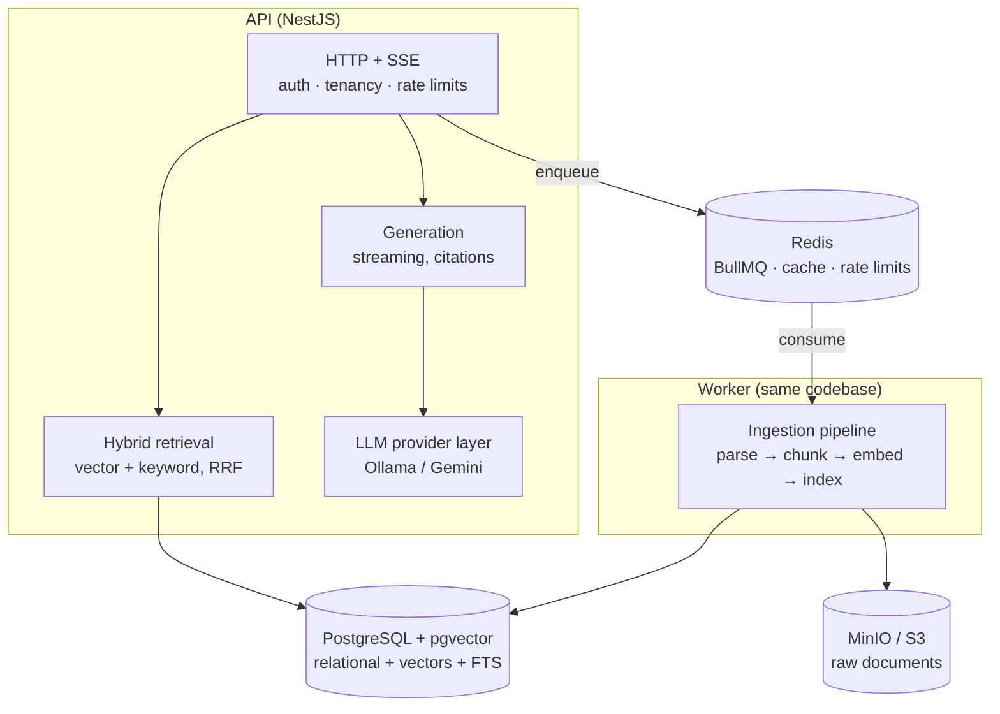

# Alexandria

**A multi-tenant knowledge-base SaaS with a production-grade RAG pipeline — built end-to-end in TypeScript.**

Teams create a workspace, upload documents (PDF, DOCX, Markdown), and ask questions in natural language. Answers stream back token-by-token with citations to the exact source passages — and the system says "I don't know" when the documents don't support an answer.

> 🚧 **Building in public.** This project is under active development, phase by phase, with the reasoning behind every architecture decision shared along the way. Follow the journey on X: [@shyam1107](https://x.com/) <!-- TODO: replace with actual handle -->

## Why this exists

Most RAG examples are "chat with one PDF" demos. Alexandria is deliberately built like a real product: asynchronous ingestion pipelines, hybrid retrieval, strict multi-tenant isolation, cost tracking, provider fallbacks, and an evaluation harness. No LangChain — every part of the pipeline is implemented explicitly, because the goal is to understand (and be able to debug) what frameworks hide.

## Architecture



Key decisions (each documented as it ships):

- **Postgres + pgvector** over a dedicated vector DB — chunk text, metadata, full-text index, and embedding live in one row, written in one transaction, tenant-filtered in one WHERE clause. Hybrid search is a SQL query, not a two-system sync problem.
- **Hybrid retrieval from day one** — vector search fails on exact identifiers, keyword search fails on paraphrase; results merge via Reciprocal Rank Fusion.
- **One codebase, two processes** — latency-sensitive API and CPU-heavy ingestion workers scale independently without microservice taxes.
- **Provider abstraction with two real implementations** — Ollama for zero-cost local dev, Gemini for demos; switching embedding providers is treated as the corpus migration it actually is.
- **Multi-tenancy enforced in the database** — tenant-scoped repositories *plus* Postgres Row-Level Security. Retrieval is isolated before any LLM sees a token.

## Stack

| Layer | Choice |
|---|---|
| Runtime / framework | Node 22+, NestJS 11, TypeScript 6 (strict) |
| Data | PostgreSQL 17 + pgvector, Drizzle ORM |
| Queue / cache | Redis + BullMQ |
| Object storage | MinIO locally, S3 in production |
| LLM / embeddings | Ollama (dev) · Gemini (demo) behind a provider interface |
| Observability | pino structured logging (metrics & tracing planned) |

## Local development

```bash
pnpm install
cp .env.example .env
pnpm infra:up        # postgres+pgvector, redis, minio (docker compose)
pnpm start:dev       # API → http://localhost:3000/docs (Swagger)
pnpm start:worker:dev
```

Ollama (local LLM, several-GB downloads) is opt-in: `pnpm infra:llm`, then pull models per `docker-compose.yml` comments.

## Roadmap

- [x] **Foundation** — NestJS scaffold (API + worker), validated config, Drizzle, dev infra, health checks with probe deadlines, Swagger
- [ ] **Identity & tenancy** — JWT auth, workspaces, RBAC, Postgres RLS
- [ ] **Ingestion** — upload → parse → chunk → embed → index via BullMQ (retries, DLQ, idempotency)
- [ ] **Retrieval** — pgvector HNSW + Postgres FTS, RRF, metadata filters, re-ranking
- [ ] **Generation** — streaming answers (SSE), citations, conversation memory, grounded refusals
- [ ] **LLM platform** — provider fallbacks, retries, per-tenant token & cost tracking
- [ ] **Hardening** — rate limiting, caching, quotas, observability
- [ ] **Quality** — test suite + RAG evaluation harness (retrieval metrics, faithfulness)
- [ ] **Deployment** — AWS (ECS/RDS/ElastiCache/S3), CI/CD
- [ ] Thin streaming chat UI for demos

## License

[MIT](./LICENSE)
